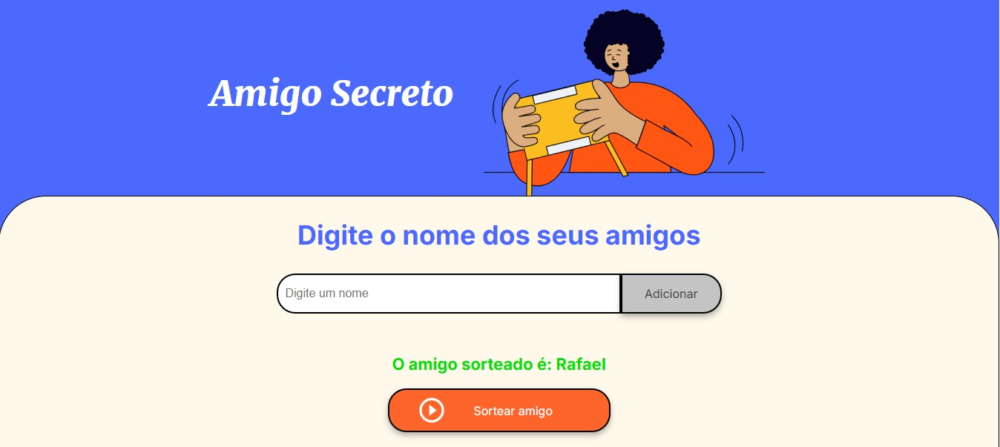

# 🎁 **Amigo Secreto** 🎁

## 📝 **Descrição do Projeto**

O projeto **Amigo Secreto** é uma aplicação simples e interativa para realizar sorteios de amigos secretos. O usuário pode adicionar amigos à lista, sortear um amigo secreto aleatoriamente, e a cada sorteio, o amigo sorteado é removido da lista. A aplicação também exibe de maneira clara o nome do amigo sorteado em tempo real.

**Funcionalidades:**
- 💬 Adicionar amigos à lista.
- 🎲 Sortear um amigo secreto aleatoriamente.
- 🚫 Remover o amigo sorteado da lista para garantir que ninguém seja sorteado mais de uma vez.
- 🧹 Limpar a lista e o resultado quando necessário.

---

## 🖥 **Tecnologias Utilizadas**

- **HTML**: Estrutura básica da página.
- **CSS**: Estilização da interface para uma experiência mais agradável.
- **JavaScript**: Lógica do sorteio, manipulação de listas e interatividade.
  
---
## 💻 Link do Projeto

Segue o link do Site Dorteador: [CLIQUE AQUI](https://rafaelflorentinobarbosa.github.io/Amigo-secreto/)

## 🔧 **Como Usar**

1. **Clone o Repositório**  
   Clone o repositório para sua máquina local:
   ```bash
   git clone https://github.com/rafaelflorentinobarbosa/Amigo-secreto
